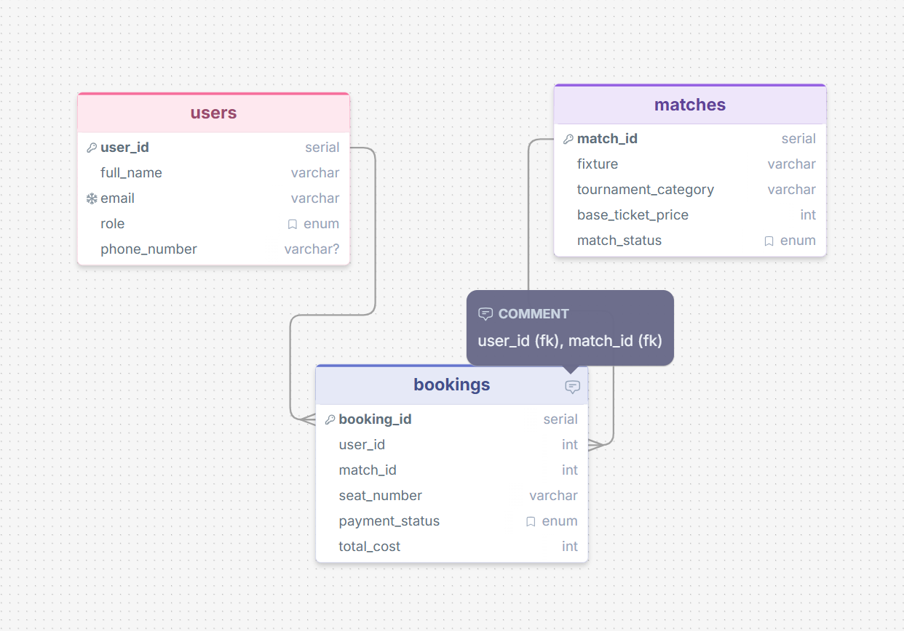

# Football Ticket Booking System
 
A relational database project built. This system models how football fans browse matches, purchase tickets, and receive booking confirmations all managed through a structured SQL database.
 
---
 
## Project Overview
 
This project covers:
 
- Designing a normalized relational database schema
- Creating an Entity Relationship Diagram (ERD) with proper cardinality
- Writing intermediate to advanced SQL queries using JOINs, subqueries, aggregations, NULL handling, and pagination
---

## ERD Diagram

> [View ERD on drawSql](https://drawsql.app/teams/mdyhakash/diagrams/football-ticket-booking-system)



**Relationships:**

```
USERS ──────< BOOKINGS >────── MATCHES
(one)        (many)  (many)     (one)
```

- **One to Many** — One user can place many bookings
- **Many to One** — Many bookings belong to one match
- **Logical One to One** — Each booking row maps exactly one user to one match for one specific seat

---
